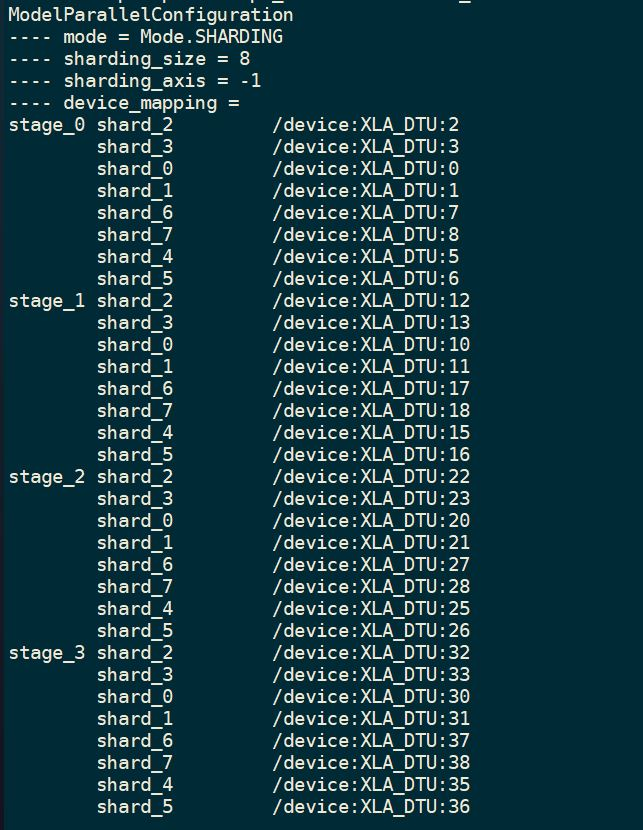
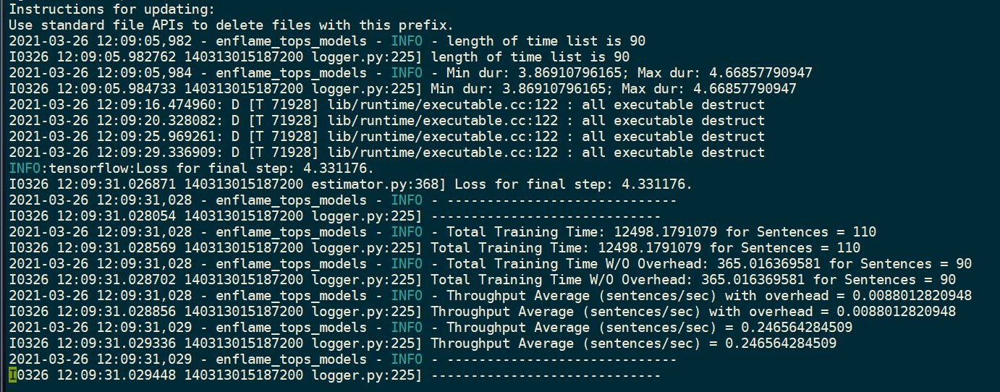

BERT-LARGE DTU CASE IV
======================

Model Parallel Hyperparams
--------------------------

- 4-way stages (stage inter-chips)
- non-pipeline (pipeline accum_degree = 1)
- 8-way shards (shard inter-clusters, intra-chips)

.. code-block:: json

    {
      "mode": "sharding",
      "sharding_size": 4,
      "sharding_dim": -1,
      "stage_cnt": 8,
      "accum_degree": 1,
      "device_mapping": {
        "stage_0": {
          "shard_0": "/device:XLA_DTU:0",
          "shard_1": "/device:XLA_DTU:1",
          "shard_2": "/device:XLA_DTU:2",
          "shard_3": "/device:XLA_DTU:3",
          "shard_4": "/device:XLA_DTU:5",
          "shard_5": "/device:XLA_DTU:6",
          "shard_6": "/device:XLA_DTU:7",
          "shard_7": "/device:XLA_DTU:8"
        },
        "stage_1": {
          "shard_0": "/device:XLA_DTU:10",
          "shard_1": "/device:XLA_DTU:11",
          "shard_2": "/device:XLA_DTU:12",
          "shard_3": "/device:XLA_DTU:13",
          "shard_4": "/device:XLA_DTU:15",
          "shard_5": "/device:XLA_DTU:16",
          "shard_6": "/device:XLA_DTU:17",
          "shard_7": "/device:XLA_DTU:18"
        },
        "stage_2": {
          "shard_0": "/device:XLA_DTU:20",
          "shard_1": "/device:XLA_DTU:21",
          "shard_2": "/device:XLA_DTU:22",
          "shard_3": "/device:XLA_DTU:23",
          "shard_4": "/device:XLA_DTU:25",
          "shard_5": "/device:XLA_DTU:26",
          "shard_6": "/device:XLA_DTU:27",
          "shard_7": "/device:XLA_DTU:28"
        },
        "stage_3": {
          "shard_0": "/device:XLA_DTU:30",
          "shard_1": "/device:XLA_DTU:31",
          "shard_2": "/device:XLA_DTU:32",
          "shard_3": "/device:XLA_DTU:33",
          "shard_4": "/device:XLA_DTU:35",
          "shard_5": "/device:XLA_DTU:36",
          "shard_6": "/device:XLA_DTU:37",
          "shard_7": "/device:XLA_DTU:38"
        }
      }
    }

Model Training Hyperparams
--------------------------

- batch size = 1
- max seq len = 384
- model type: ``BERT-LARGE``

Status
------

- ``avg_step_fps`` = 0.247

Snapshots - configuration
-------------------------

Snapshots - results 
-------------------

