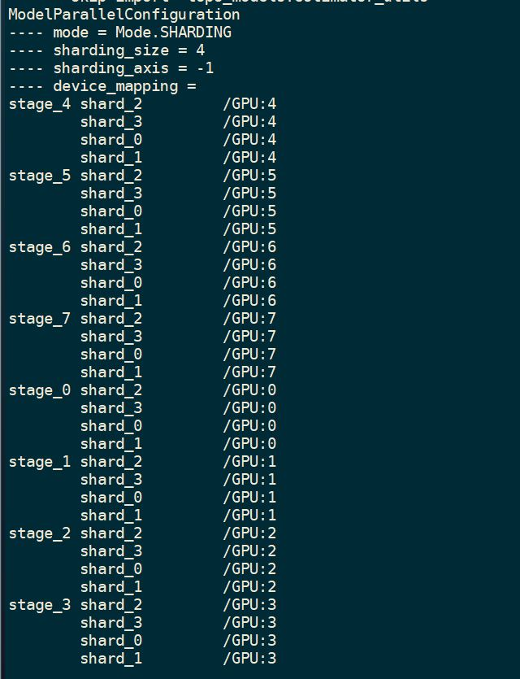
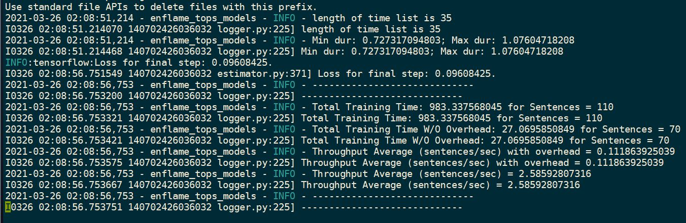

BERT-LARGE GPU CASE II
======================

Model Parallel Hyperparams
--------------------------

- 8-way stages (stage inter-chips)
- non-pipeline (pipeline accum_degree = 1)
- 4-way shards (shard inter-clusters, intra-chips)

.. code-block:: json

    {
      "mode": "sharding",
      "sharding_size": 4,
      "sharding_dim": -1,
      "stage_cnt": 8,
      "accum_degree": 1,
      "device_mapping": {
        "stage_0": {
          "shard_0": "GPU:0",
          "shard_1": "GPU:0",
          "shard_2": "GPU:0",
          "shard_3": "GPU:0"
        },
        "stage_1": {
          "shard_0": "GPU:1",
          "shard_1": "GPU:1",
          "shard_2": "GPU:1",
          "shard_3": "GPU:1"
        },
        "stage_2": {
          "shard_0": "GPU:2",
          "shard_1": "GPU:2",
          "shard_2": "GPU:2",
          "shard_3": "GPU:2"
        },
        "stage_3": {
          "shard_0": "GPU:3",
          "shard_1": "GPU:3",
          "shard_2": "GPU:3",
          "shard_3": "GPU:3"
        },
        "stage_4": {
          "shard_0": "GPU:4",
          "shard_1": "GPU:4",
          "shard_2": "GPU:4",
          "shard_3": "GPU:4"
        },
        "stage_5": {
          "shard_0": "GPU:5",
          "shard_1": "GPU:5",
          "shard_2": "GPU:5",
          "shard_3": "GPU:5"
        },
        "stage_6": {
          "shard_0": "GPU:6",
          "shard_1": "GPU:6",
          "shard_2": "GPU:6",
          "shard_3": "GPU:6"
        },
        "stage_7": {
          "shard_0": "GPU:7",
          "shard_1": "GPU:7",
          "shard_2": "GPU:7",
          "shard_3": "GPU:7"
        }
      }
    }

Model Training Hyperparams
--------------------------

- batch size = 2
- max seq len = 384
- model type: ``BERT-LARGE``

Status
------

- ``avg_step_fps`` = 2.59

Snapshots - configuration
-------------------------

Snapshots - results 
-------------------

